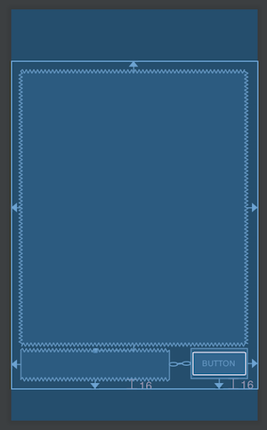
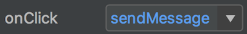
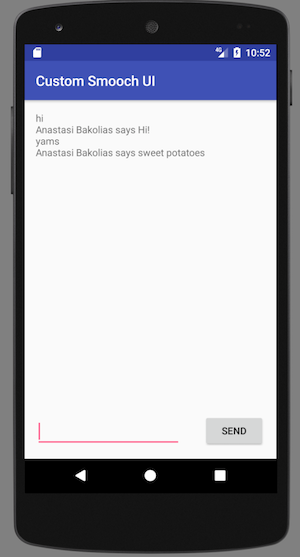

# Creating your own UI with the Smooch Android SDK

**This guide shows you how to create your own UI for the Smooch Android SDK.**

The Smooch Android SDK comes with a rich prebuilt user interface with the option to configure the interface using the Smooch dashboard or the REST API.

If needed you can completely replace Smooch's default UI with your own interface.

Although you can replace the default UI, note that this means rewriting support for all the Smooch message types, that you want to support in your custom UI.

## Overview

The Android SDK can be initialized without displaying it's default UI. You can then make use of the SDK's messaging APIs to send messages, and it's conversation delegate methods to receive messages.

This guide is separated into two parts:
- [Part One](#) for setting up a generic UI in Android
- [Part Two](#) for dropping Smooch methods in to add the messaging functionality.

It will help to have the [SDK documentation](https://docs.smooch.io/api/android/index.html) on hand while following this guide.

The complete code for this guide is included in this repository.

## Part One: setting up the UI

In part one we'll set up the UI that we can drop Smooch into in part two.

### 1. Create a new project
Create a new project in Android Studio and select "Empty Activity" as a layout.


### 2. Add UI elements
In the _res > layout > activity_main.xml_ file, remove any existing Hello World elements and add **TextView**, **Plain Text**, and **Button** elements. The elements should have the following IDs:
- TextView: `textView`
- Plain Text: `editText`
- Button: `button`

Arrange the layout to be something like this:




### 3. Prepare to render conversation history in the TextView element

First we'll set up a property to store the conversation state in text. In _java > MainActivity_ in the _MainActivity_ class add a _chatHistoryText_ String property, like so:

```java
public class MainActivity extends AppCompatActivity {
    public String conversationText = "";
    ...
}
```

Now we'll create a render method in the _MainActivity_ class:

```java
public void renderConversationHistory() {
    TextView textView = findViewById(R.id.textView);
    textView.setText(conversationText);
}
```

### 4. Handle input from the Plain Text element
Now we're going to handle the user pressing the send button so that we can treat their text input as a message.

First we'll create a function called _sendMessage_ to handle the event:

```java
public void sendMessage(View view) {
    EditText editText = findViewById(R.id.editText);
    String text = editText.getText().toString();
    Log.d("MainActivity", "sendMessage: " + text);
    editText.setText("", TextView.BufferType.EDITABLE);
    conversationText += text + "\n";
    renderConversationHistory();
}
```

The _sendMessage_ function is logging the text to the console and resetting the input to an empty state. We're also adding the message to our conversation history and rendering it. When we implement the Smooch pieces, this is where we'll send a message instead of logging it.

In _activity_main.xml_ select the Button element and in the attributes menu set the value of **onClick** to the _sendMessage_ method, and the value of **text** to _"Send"_.



---

That concludes the first part of this guide. At this point your _MainActivity_ should look something like this:

```java
public class MainActivity extends AppCompatActivity {
    public String conversationText = "";

    @Override
    protected void onCreate(Bundle savedInstanceState) {
        super.onCreate(savedInstanceState);
        setContentView(R.layout.activity_main);
    }

    public void renderConversationHistory() {
        TextView textView = findViewById(R.id.textView);
        textView.setText(conversationText);
    }

    public void sendMessage(View view) {
        EditText editText = findViewById(R.id.editText);
        String text = editText.getText().toString();
        Log.d("MainActivity", "sendMessage: " + text);
        editText.setText("", TextView.BufferType.EDITABLE);
        conversationText += text + "\n";
        renderConversationHistory();
    }
}
```

---

## Part Two: adding messaging to the app
Now that we've defined the UI for our messaging application, we can call Smooch's core messaging methods to add functionality.

### 1. Integrate Smooch

See this [guide](https://docs.smooch.io/guide/native-android-sdk/) for adding the Smooch framework to your app. We've included a quick start here:
- in _Gradle Scripts > build.gradle (Module: app)_ add the line `implementation 'io.smooch:core:5.7.3'` to dependencies
- click _Sync Now_ to load the new dependency.

Now in the _MainActivity_ class's _onCreate_ method add the following init call to initialize Smooch:

```java
protected void onCreate(Bundle savedInstanceState) {
  ...
  Smooch.init(getApplication(), new Settings("<your_app_id>"), new SmoochCallback() {
      @Override
      public void run(SmoochCallback.Response response) {}
  });
}
```

### 2. Send messages

When the user enters text input and presses _Send_ we're going to send an app user message to Smooch.

In our _sendMessage_ method in _MainActivity_ replace this line that was logging our message:

```java
Log.d("MainActivity", "sendMessage: " + text);
```

with this line, sending the message:

```java
Smooch.getConversation().sendMessage(new Message(text));
```

The _sendMessage_ method should now look like this:

```java
public void sendMessage(View view) {
    EditText editText = findViewById(R.id.editText);
    String text = editText.getText().toString();
    Smooch.getConversation().sendMessage(new Message(text));
    editText.setText("", TextView.BufferType.EDITABLE);
    conversationText += text + "\n";
    renderConversationHistory();
}
```

### 3. Display messages
We're going to render our initial conversation state.

First we're going to create a new method to write messages to our _conversationText_ property. In _MainActivity_ add a _getMessages_ method:

```java
public void getMessages() {
    List<Message> messages;
    for (Message message : messages = Smooch.getConversation().getMessages()) {
        String text = !message.isFromCurrentUser() ? message.getName() + " says " + message.getText() : message.getText();
        conversationText += text + "\n";
    }
}
```

Now in our _onCreate_ method in _MainActivity_ we can call _getMessages_ and _renderConversationHistory_ in the _Smooch.init_ callback to show existing messages when the application loads.

Add calls to those two methods in the initialization callback:

```java
protected void onCreate(Bundle savedInstanceState) {
      ...
      Smooch.init(getApplication(), new Settings("5a4becab852acd004bdedffc"), new SmoochCallback() {
          @Override
          public void run(SmoochCallback.Response response) {
              getMessages();
              renderConversationHistory();
          }
      });
}
```

### 4. Receive new messages
Smooch exposes [conversation delegate methods](https://docs.smooch.io/api/android/io/smooch/core/Conversation.Delegate.html) that allow you to capture incoming and outgoing messages as well as other events. We're going to use these methods to display new messages in our UI.

First we're going to implement the delegate in our _MainActivity_ class with _implements Conversation.Delegate_ like so:

```java
public class MainActivity extends AppCompatActivity implements Conversation.Delegate {...}
```

Once you add that implementation the Android Studio IDE will give you the option of providing the methods required by them implementation. Add the required methods automatically. They are:

- onMessagesReceived
- onUnreadCountChanged
- onMessagesReset
- onMessageSent
- onConversationEventReceived
- onInitializationStatusChanged
- onLoginComplete
- onLogoutComplete
- onPaymentProcessed
- shouldTriggerAction
- onCardSummaryLoaded
- onSmoochConnectionStatusChanged
- onSmoochShown
- onSmoochHidden

We need to modify two of these delegate methods.

First, we should change _shouldTriggerAction_ to return `true` instead of `false`, otherwise it will silently consume outgoing message actions. Change the method to be:

```java
public boolean shouldTriggerAction(MessageAction messageAction) {
    return true;
}
```

Second, we need to call our _getMessages_ and _renderConversationHistory_ methods in the _onMessagesReceived_ delegate so that we update the UI when new messages are received. Add those calls like so:

```java

```

Lastly, in the _onCreate_ method, we need to attach our _MainActivity_ as the delegate to the Smooch conversation by adding this line to the init callback:

```java
protected void onCreate(Bundle savedInstanceState) {
      ...
      Smooch.init(getApplication(), new Settings("5a4becab852acd004bdedffc"), new SmoochCallback() {
          @Override
          public void run(SmoochCallback.Response response) {
              Smooch.getConversation().setDelegate(MainActivity.this);
              ...
          }
      });
}
```

## Wrap up

You've created your own UI for the Smooch Android SDK. It should look something like this:



Now you might want to consider how you'll represent more complex messages and activities, such as:
- [structured messages](https://docs.smooch.io/guide/structured-messages/)
- [conversation extensions](https://docs.smooch.io/guide/conversation-extensions/)
- [conversation activity](https://docs.smooch.io/rest/#conversation-activity)

You can also follow [these instructions](https://docs.smooch.io/guide/native-android-sdk/#step-3-configure-android-application-to-accept-push) for handling push notifications.
